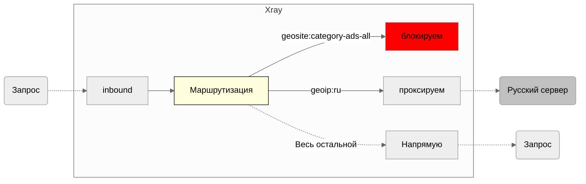


Статья находится в режиме написания. Со временем будет дополняться и изменяться. 


Модуль маршрутизации позволяет нам отправлять входящие данные через различные исходящие соединения в соответствии с обьявленными правилами правилами.

## Введение в маршрутизацию

Для понимания маршрутизации необходимо осознать, что полноценная функциональность маршрутизации требует совместной работы трех компонентов: 
```mermaid
erDiagram
    ALEMBIC_VERSION ||--o{ SYSTEM : ""
    JWT ||--o{ SYSTEM : ""
    EXCLUDE_INBOUNDS_ASSOCIATION {
        string proxy_id
        string inbound_tag
    }
    SYSTEM ||--o{ EXCLUDE_INBOUNDS_ASSOCIATION : ""
    PROXIES ||--o{ EXCLUDE_INBOUNDS_ASSOCIATION : ""
    INBOUNDS ||--o{ EXCLUDE_INBOUNDS_ASSOCIATION : ""
    TEMPLATE_INBOUNDS_ASSOCIATION {
        string user_template_id
        string inbound_tag
    }
    USER_TEMPLATES ||--o{ TEMPLATE_INBOUNDS_ASSOCIATION : ""
    INBOUNDS ||--o{ TEMPLATE_INBOUNDS_ASSOCIATION : ""
    TLS ||--o{ HOSTS : ""
    HOSTS ||--o{ INBOUNDS : ""
    NODE_USER_USAGES {
        string user_id
        string node_id
        string used_traffic
    }
    USERS ||--o{ NODE_USER_USAGES : ""
    NODES ||--o{ NODE_USER_USAGES : ""
    USERS ||--o{ PROXIES : ""
    NODE_USAGES ||--o{ NODES : ""
    NOTIFICATION_REMINDERS ||--o{ USERS : ""
    USER_USAGE_LOGS ||--o{ USERS : ""
    ADMINS ||--o{ USERS : ""
}
```

1. Входящий трафик (inbound)
2. Маршрутизация
3. Исходящий трафик (outbound)

Эти компоненты работают вместе и важно понимать: любая ошибка в одном из этих элементов может привести к сбою в работе маршрутизации.


