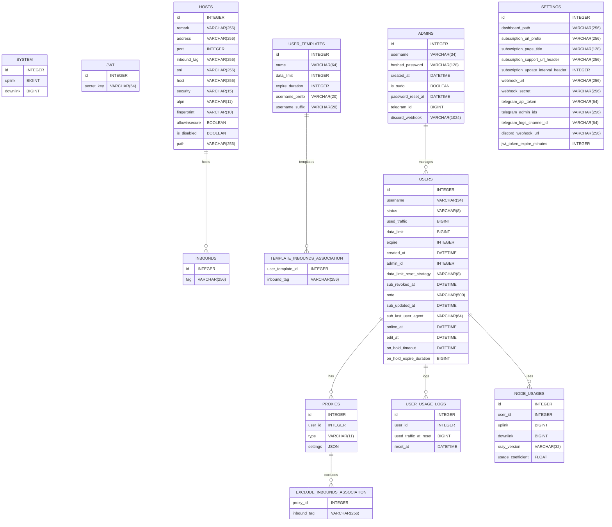
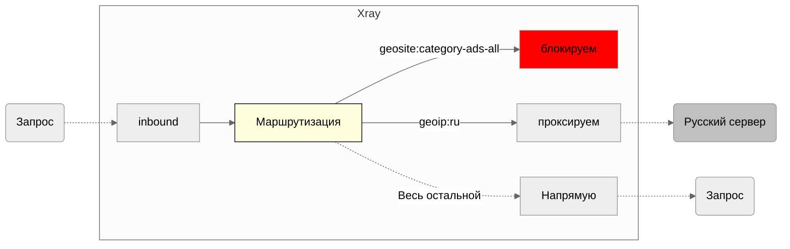


Статья находится в режиме написания. Со временем будет дополняться и изменяться. 


Модуль маршрутизации позволяет нам отправлять входящие данные через различные исходящие соединения в соответствии с обьявленными правилами правилами.

## Введение в маршрутизацию

Для понимания маршрутизации необходимо осознать, что полноценная функциональность маршрутизации требует совместной работы трех компонентов: 

1. Входящий трафик (inbound)
2. Маршрутизация
3. Исходящий трафик (outbound)

Эти компоненты работают вместе и важно понимать: любая ошибка в одном из этих элементов может привести к сбою в работе маршрутизации.

